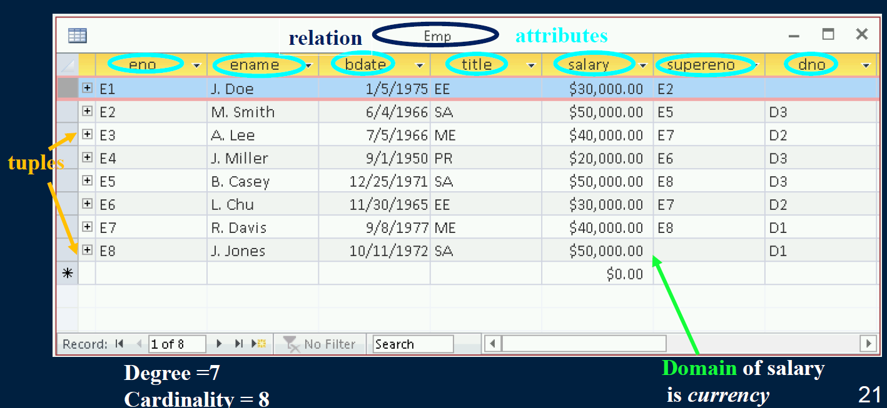
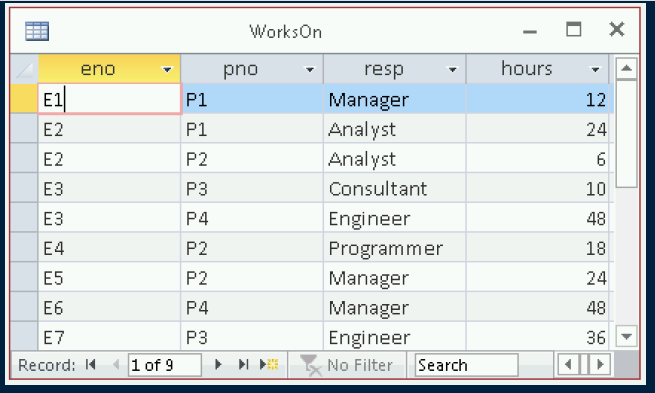
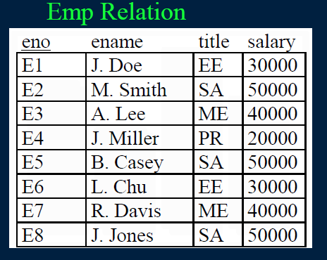
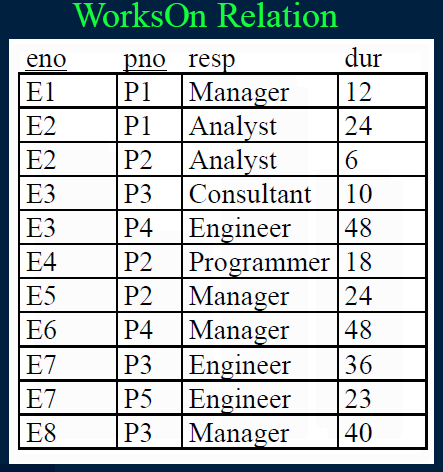
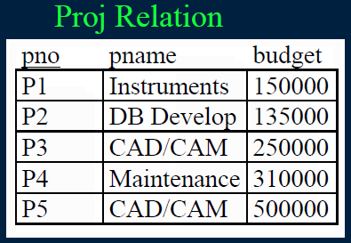
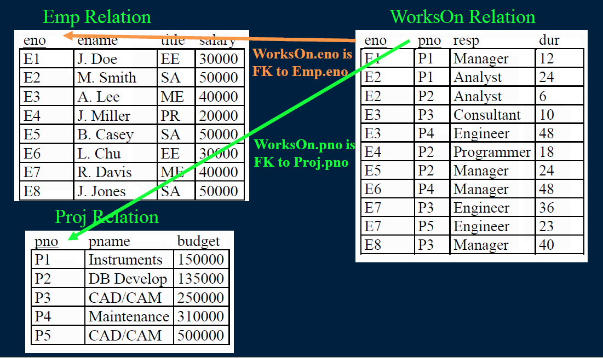
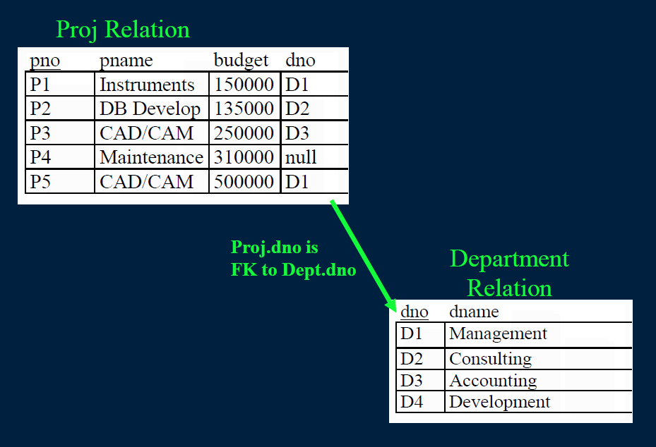

# Lecture 01

## Introductions

### The Essence of the Course
The overall goal of this course is for you to:  
**Understand how to create, query, and program with databases to perform data analysis with larger data sets.**

This course covers database techniques and software including relational and NoSQL databases, XML, and JSON.  

Data analysts must have fluency in SQL and other query languages to extract and analyze data from a variety of systems.  

### My Course Goals
- Provide the information in a simple, concise, and effective way for learning.
- Strive for ***all*** students to understand the material and excel at the course.
- Be available for questions during class time, office hours, and at other times as needed.
- Teach students how to be a sophisticated database user (by being fluent in SQL), write programs that access a database, and be able to read and understand database design (ER) diagrams.

### Course Objectives
- Understand the use case for databases and the relational model for data storage.
- Fluency in SQL including SQL DDL (CREATE, DROP, INSERT, UPDATE, DELETE) and SQL queries using SELECT.
- Construct programs that access a database to read data, perform analysis, and output results.
- Exposure to database technologies like NoSQL, JSON, and XML.
- Understand how to read database design (ER) diagrams and convert to the relational model.

### Academic Dishonesty
Cheating is strictly prohibited and is taken very seriously by UBC.  
A guideline to what constitutes cheating:
- Labs
  - Submitting code produced by others.
  - Working in groups to solve questions and/or comparing answers to questions once they have been solved (except for group assignments).
  - Discussing HOW to solve a particular question instead of WHAT the question involves.
- Exams
  - Only materials permitted by instructor should be in the exam.
  
Academic dishonesty may result in a "F" for the course and removal from the MDS program.

### How to Excel in This Course
Attend ***every*** class:
- **Read notes *before* class as preparation and try the questions.**
- **Participate in class exercises and questions.**

Attend and complete all labs:
- **Labs practice the fundamental employable skills as well as being for marks.**

Practice on your own. Practice makes perfect.
- **Do more questions than in the labs.**
- **Read the additional reference material and perform practice questions.**

### Systems and Tools
Course material is on GitHub.   
Marks are distributed on Canvas.  
Your laptop will be used to install all software and run programs.  

### The Lab Assignments
Weekly lab assignments are worth **30%** of your overall grade.

Lab assignments may take more than the two hours lab time.

You have until the week after the lab to complete it.
- **No late labs will be accepted.**
- **A lab may be handed in any time before the due date and may be marked immediately by the TA in the lab.**

Lab assignments are done individually.

The lab assignments are critical to learning the material and are designed both to prepare you for the quizzes and build up your skills!

### The In-Class Clicker Quizzes
To promote understanding, 10% of your overall grade is allocated to answering in-class questions.

These questions are answered electronically using a clicker.
- **The clicker can be purchased at the bookstore.**
- **The clicker is personalized to you with your student number.**
- **At different times during all the lectures, questions reviewing material will be asked. Reponses are given using clickers.**

There will be at least 50 questions throughout the semester. Each question is worth 1 mark, and you need at least 40 right answers to get the full 5%.
- **That is, if you answer 30 questions right, you get 30/40 or 75%. Thus, do not worry if you forget your clicker one day!** 

### Database Survey Question
***Question:***    
Have you used any of these database systems?  
A) MySQL  
B) Microsoft Access or SQL Server  
C) PostgreSQL  
D) Used more than two different databases  
E) Used no databases  

What Grade are You Expecting to Get?  
A) A  
B) B  
C) C  
D) D  
F) F  

### Why This Course is Important
Database systems store the majority of data that data analysts use.
Key skills:
- ***Query/update databases* - SQL to extract information from existing databases.**
- ***Program with databases* - Learn how to use Python and R to access data in a database then perform further analysis.**
- ***Be aware of data technologies* - XML, NoSQL, JSON, and a variety of others.**

### Why Relational Databases?
***Relational databases*** allow for the storage and analysis of large amounts of data.

Relational databases are the most common form of database used by companies and organizations for data management.

Since a significant amount of data is stored in relational databases, understanding how to create and query these databases using the SQL standard is a very valuable skill.

<STAR SLIDE STARTS>

### What is a database?
A **database** is a collection of logically related data for a particular domain.
  
A **database management system (DBMS)** is software designed for the creation and management of databases.
- *e.g. Oracle, DB2, Microsoft Access, MySQL, SQL Server, MongoDB*

Bottom line: A **database** is the *data* stored and a **database system** is the *software* that manages the data.

<STAR SLIDE ENDS>

### Databases in the Real-World
Databases are everywhere in the real-world even though you do not often interact with them directly.
- $40 billion dollar annual industry

Examples:
- Retailers manage their products and sales using a database.
- Wal-Mart has one of the largest databases in the world!
- Online web sites such as Amazon, eBay, and Expedia track orders, shipments, and customers using databases.
- The university maintains all your registration information and marks in a database that is accessible over the Internet.

Can you think of other examples?  
What data do you have?
  

### Data Independence and Abstraction
Without a database, applications use files to store data persistently. A **file-based system** has several problems: code and data duplication, high maintenance costs, and difficulty in supporting multiple users.
- *There is no **program-data independence** separating the application from the data it is manipulating. If the data file changes, the code must be changed.*

Databases provide **data abstraction** allowing the internal representation of the data to change without affecting programs that use the object through an external definition.
- *The DBMS takes the description of the data and handles the low-level details of how to store it, retrieve it, and provide concurrent access to it.*

### Database System Properties
A database system provides efficient, convenient, and safemulti-userstorage and access to massiveamounts of persistentdata.  

**Efficient** - Able to handle large data sets and complex queries without searching all files and data items.  
**Convenient** - Easy to write queries to retrieve data.  
**Safe** - Protects data from system failures and hackers.  
**Massive** - Database sizes in gigabytes, terabytes and petabytes.
**Persistent** - Data exists even if have a power failure.
**Multi-user** - More than one user can access and update data at the same time while preserving consistency.

<STAR SLIDE STARTs>
  
### Database Terminology
A **data model** is a collection of concepts that is used to describe the structure of a database. E.g. relational, XML, graphs, objects, JSON
- *In the relational model, data is represented as tables and fields.*

**Data Definition Language(DDL)** allows the user to create data structures in the data model used by the database. A **schema** is a description of the structure of the databaseand is maintained and stored in the **system catalog**. The schema is **metadata**.
- *A schema contains structures, names, and types of data stored.*

Once a database has been created using DDL, the user accesses data using a **Data Manipulation Language(DML)**.
- *The DML allows for the insertion, modification, retrieval, and deletion of data.*

SQL is a standard DDL and DML for the relational model.

<STAR SLIDE ENDS>

<STAR SLIDE STARTS>
  
### The Relational Model: Terminology
The **relational model** organizes data into tables called relations.
- *Developed by E. F. Codd in 1970 and used by most database systems.*

Terminology:
- A **relation** is a table with columns and rows.
- An **attribute** is a named column of a relation.
- A **tuple** is a row of a relation.
- A **domain** is a set of allowable values for one or more attributes.
- The **degree** of a relation is the number of attributes it contains.
- The **cardinality** of a relation is the number of tuples it contains.

<STAR SLIDE ENDS>
  
### Relation Example

### Relation Practice Questions

1) What is the name of the relation?  
2) What is the cardinality of the relation?  
3) What is the degree of the relation?  
4) What is the domain of `resp`? What is the domain of `hours`?  

<START SOLUTIONS HERE>
  
1) WorksOn  
2) 9  
3) 4  
4) Domain of resp is a string.  Domain of hours is a number (integer).  

<END SOLUTIONS HERE> 

### Database Definition Question

**Question**:  
How many of the following statements are **TRUE**?  
1) A database is data.  
2) A database system is software.  
3) A database system will lose the data stored when the power is turned off.  
4) Usually, more than one user can use a database system at a time.  
5) The cardinality is the number of rows in a relation.  
6) A relation's cardinality is always bigger than its degree.  
A)1 B)2 C)3 D)4 E)5

<START SOLUTIONS HERE>
  
Answer: D  
True statements:  
1) A database is data.  
2) A database system is software.  
4) Usually, more than one user can use a database system at a time.  
5) The cardinality is the number of rows in a relation.  

<END SOLUTIONS HERE> 

### Database Definition Matching Question
**Question**: Given the three definitions, select the ordering that contains their related definitions.  
1) relation  
2) tuple  
3) attribute  

A) column, row, table  
B) row, column, table    
C) table, row, column  
D) table, column, row  

<START SOLUTIONS HERE>
  
Answer: C) table, row, column

<END SOLUTIONS HERE> 

### Cardinality and Degree Question
**Question**: A database table has 5rows and 10 columns. Select **one** true statement.

A) The table's degree is 50.  
B) The table's cardinality is 5.  
C) The table's degree is 5.  
D) The table's cardinality is 10.  

<START SOLUTIONS HERE>
  
Answer: B (cardinality is the number of rows)

<END SOLUTIONS HERE> 

### Relation Properties
1) No two relations have the same name.  
2) Each attribute of a relation has a distinct name.  
3) Each tuple is distinct. There are no duplicate tuples.  
4) The order of attributes is not important.  
5) The order of tuples has no significance.  

<STAR SLIDE STARTS>
  
### Relational Keys
Keys are used to uniquely identify a tuple in a relation.  
- **Note that keys apply to the schema not to the data. That is, looking at the current data cannot tell you for sure if the set of attributes is a key.**

A *superkey* is a set of attributes that uniquely identifies a tuple in a relation.

A *(candidate) key* is a minimalset of attributes that uniquely identifies a tuple in a relation.
- **There may be more than 1candidate key for a relation with different # of attributes.**

A *primary key* is the candidate key designated as the distinguishing key of a relation.

A *foreign key* is a set of attributes in one relation referring to the primary key of a relation.
- **Foreign keys enforce referential integrity. Note: A FK may refer to its own relation.**

<STAR SLIDE ENDS>
  

### Keys and Superkeys Question
**Question:**
*True or false*: A key is always a superkey.  
A) true  
B) false  

<START SOLUTIONS HERE>
  
Answer: A) true 
A key is a minimal set of attributes that uniquely identifies a row in a table.  A superkey uniquely identifies a row but does not have to be minimal.  Thus, a key is always a superkey but not vice versa.

<END SOLUTIONS HERE>

### Keys and Superkeys Question (2)
**Question:**
*True or false*:It is possible to have more than one key for a table and the keys may have different numbers of attributes.  
A) true  
B) false  

<START SOLUTIONS HERE>
  
Answer:  A) true
A good example is that students in the class could be identified by student id  and (first name, last name).  These are both keys, but the first one has one attribute and the second has two.

<END SOLUTIONS HERE>

### Keys and Superkeys Question (3)
**Question:**  
*True or false*:It is possible to always determine if a field is a key by looking at the data in the table.  
A) true  
B) false  

<START SOLUTIONS HERE>
  
Answer:  B) false  Keys are part of the schema not the data.

<END SOLUTIONS HERE>

### Example Relational Data Questions

 

Questions:  
1) Is enamea key for emp?  
2) Is enoa key for WorksOn?  
3) List all the superkeys for WorksOn.  

<START SOLUTIONS HERE>
  
1) Probably not.  According to what we are modeling we are not told that ename is a key and cannot assume that it is just because there are no two people with duplicate names in the current relation instance.

2) No because there are two tuples with value the same value E7 for eno.  Also, we know from the project description that an employee can work on multiple projects, which means that for each project they work on there would be a tuple in the WorksOn relation.  Hence, duplicate values of eno is possible.

3) Superkeys = {(eno,pno), (eno,pno,resp), (eno,pno,dur), (eno,pno,resp,dur) }

<END SOLUTIONS HERE>

<STAR SLIDE STARTS>
  
### Relational Integrity
Integrity rules are used to insure the data is accurate.

**Constraints** are rules or restrictions that apply to the database and limit the data values it may store.

Types of constraints:
- **Domain constraint** - Every value for an attribute must be an element of the attribute's domain or be `null`.
  - `null` represents a value that is currently unknown or not applicable.
  - `null` is not the same as zero or an empty string.
- **Entity integrity constraint** - No attribute of a primary key can be null.
- **Referential integrity constraint** - If a foreign key exists in a relation, then the foreign key value must match a primary key value of a tuple in the referenced relation or be null.

<STAR SLIDE ENDS>

### Foreign Keys Example

### Foreign Keys Example (2)

### Integrity Constraints Question
**Question**: What constraint says that a primary key field cannot be null?  
A) domain constraint  
B) referential integrity constraint  
C) entity integrity constraint  

<START SOLUTIONS HERE>
  
Answer: C

<END SOLUTIONS HERE>

### Entity Integrity Constraint Question
**Question**: A primary key has three fields. Only one field is null. Is the entity integrity constraint violated?  
A) Yes  
B) No 

<START SOLUTIONS HERE>
  
Answer: A  (only one field has to be null, not all of them)

<END SOLUTIONS HERE>

### Referential Integrity Constraint Question
**Question**: A foreign key has a nullvalue in the tablethat contains the foreign key fields. Is the referential integrity constraint violated?  
A) Yes  
B) No  

<START SOLUTIONS HERE>
  
Answer: B  Foreign key field can be null.  They just cannot contain a value that is not in the primary key.

<END SOLUTIONS HERE>

### Integrity Questions
 

Question: How many rows have violations of integrity constraints? Note: salary, budget, dur are number fields.  
A) 8 B) 9 C) 10 D) 11 E) 12

<START SOLUTIONS HERE>
  
Answer: B) 9  
Emp violations:  
- tuple 1 - salary = "AS" (domain)
- tuple 6 - eno = null (entity integrity)  
Proj violations:  
- none
WorksOn violations:  
- tuple 1 - pno = "P0" (ri)
- tuple 3 - eno = null (ei)
- tuple 5 - eno = "E9" (ri)
 tuple 7 - pno = null (ei)  
 tuple 8 – E6 (ri)    
tuple 9 – P6 (ri)  
 tuple 11 - eno = null, pno = null (ei)  

<END SOLUTIONS HERE>

### Relational Algebra Query Language
A *query language* is used to update and retrieve data that is stored in a data model.

*Relational algebra* is a set of relational operations for retrieving data.
- **Just like algebra with numbers, relational algebra consists of operands (which are relations) and a set of operators.**

Every relational operator takes as input one or more relations and produces a relation as output.

A sequence of relational algebra operators is called a *relational algebra expression*.

Relational algebra is the foundation of all relational database systems. SQL gets translated into relational algebra.

### Conclusion
A *database* is a collection of logically related data managed by a *database management system* (DBMS).
- **Provides data independence and abstraction**
- **Data definition and manipulation languages (DDL and DML)**

The *relational model* represents data as relations which are sets of tuples. Each relational schema is a set of attributes with domains.

The relational model has *constraints* to guarantee data integrity including: domain, entity integrity and referential integrity constraints. *Keys* are used to uniquely identify tuples in relations.

*Relational algebra* is a set of operations for answering queries on data stored in the relational model.

### Objectives
- Define: database, DBMS, schema, metadata
- Define program-data independence/data abstraction and explain how it is achieved by databases but not by file systems.
- Define: relation, attribute, tuple, domain, degree, cardinality
- Define DDL and DML. What is the difference?
- List the properties of relations.
- Define: superkey, key, candidate key, primary key, foreign key
- Define: integrity, constraints, domain constraint, entity integrity constraint, referential integrity constraint
- Given a relation be able to:
  - identify its cardinality, degree, domains, keys, and superkeys
  - determine if constraints are being violated
- Define: relational algebra, query language

