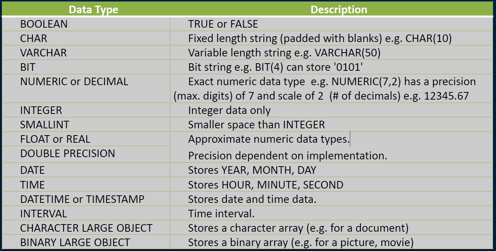
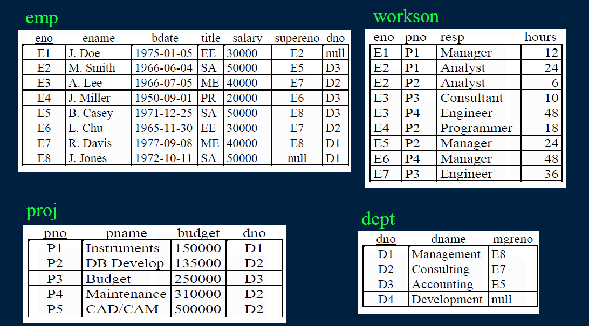
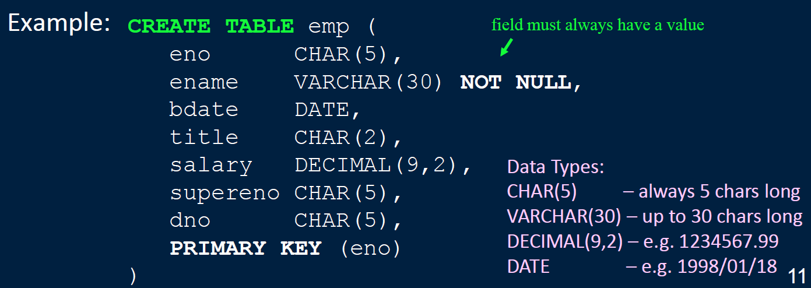
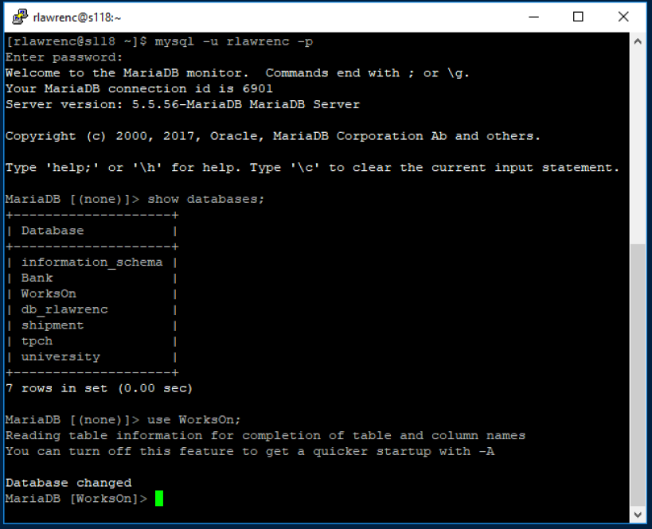
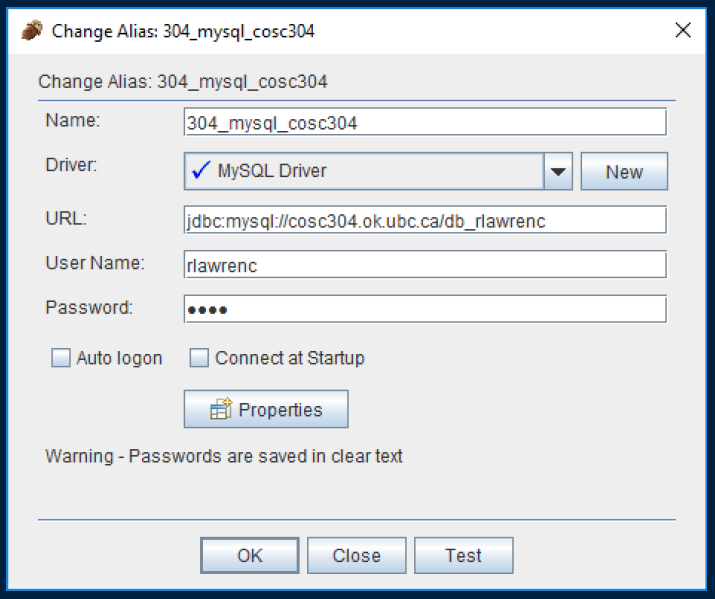

# Lecture 2

## SQL DDL: CREATE, INSERT, DELETE, UPDATE

### SQL Overview
**S**tructured **Q**uery **L**anguage or SQL is the standard query language for relational databases.
- **It first became an official standard in 1986 as defined by the American National Standards Institute (ANSI).**
- **All major database vendors conform to the SQL standard with minor variations in syntax (different dialects).**
- **SQL consists of both a Data Definition Language (DDL) and a Data Manipulation Language (DML).**

SQL is a *declarative language*(non-procedural). A SQL query specifies whatto retrieve but not howto retrieve it.
- **Basic SQL is not a complete programming language as it does not have control or iteration commands.**
  - **Procedural extensions: PL/SQL (Oracle), T-SQL (SQL Server)**
  
### SQL History
SQL history:
- 1970 -Coddinvents relational model and relational algebra
- 1974 -Donald Chamberlin (also at IBM) defined Structured English Query Language (SEQUEL)
- 1976 -SEQUEL/2 defined and renamed SQL for legal reasons.
  - Origin of pronunciation 'See-Quel' but official pronunciation is 'S-Q-L'.
- First standardized in 1986 by the American National Standards Institute (ANSI).
- 1992 -SQL2 (SQL92) revision
- 1999 -SQL3 (supports recursion, object-relational)
- Updates: SQL:2003, SQL:2006, SQL:2008, SQL:2011,SQL:2016


### SQL Basic Rules
1) There is a set of reserved wordsthat cannot be used as names for database fields and tables.  
- SELECT, FROM, WHERE, etc.
2) SQL is generally case-insensitive.  
- Only exception is string constants. 'FRED' not the same as 'fred'.  
3) SQL is free-formatand white-space is ignored.  
4) The semi-colon is often used as a statement terminator, although that is not always required.  
5) Date and time constants have defined format:
  - Dates: 'YYYY-MM-DD' e.g. '1975-05-17'
  - Times: 'hh:mm:ss[.f] ' e.g. '15:00:00'
  - Timestamp: 'YYYY-MM-DD hh:mm:ss[.f]' e.g. '1975-05-17 15:00:00'
6) Two single quotes ''are used to represent (escape) a single quote character in a character constant. e.g. 'Master''s'.  


### SQL Identifiers
*Identifiers* are used to identify objects in the database such as tables, views, and columns.
- **The identifier is the name of the database object.**
An SQL identifier (name) must follow these rules:
- **only contain upper or lower case characters, digits, and underscore ("_") character**
- **be no longer than 128 characters**
  - **DB vendors may impose stricter limits than this.**
- **must start with a letter (or underscore)**
- **cannot contain spaces**
- **Note: Quoted or *delimited identifiers* enclosed in double quotes allow support for spaces and other characters. E.g. "select"**

### Database Identifier Question
**Question**: Select *one* valid identifier.  
A) `23test`  
B) `'fred'`  
C) `test_!`  
D) `field_`  
E) `from`  

### Delimited Database Identifiers
**Question**: *True or False*: "from"can be used as a valid identifier according to the SQL standard.
A) True  
B) False  

### SQL Data Types
In the relational model, each attribute has an associated domain of values.

In SQL, each column (attribute) has a *data type* that limits the values that it may store. The standard SQL data types are similar to their programming language equivalents.

The database will perform (implicit) data type conversion when necessary.

Explicit data type conversion using functions such as `CAST` and `CONVERT`.


### SQL Data Types (2)



### Example Database -WorksOn



<STAR SLIDE STARTS>
### SQL CREATE TABLE
The `CREATE TABLE` command is used to create a table in the database. A table consists of a table name and a set of fields with their names and data types.



<STAR SLIDE ENDS>


### SQL Constraints
Constraints are specified in `CREATE` and `ALTER TABLE` statements.

Types of constraints:
1) *Required data* - To specify that a column must always have a data value (cannot be `NULL`) specify `NOT NULL` after the column definition.
  - **e.g. `eno CHAR(5) NOT NULL`**
  - **If a field is `UNIQUE`or a `PRIMARY KEY, NOT NULL` is not necessary.**

2) *Domain constraints* - Verify that the value of a column is in a given domain using `CHECK`.
  - **e.g. title `CHAR(2) CHECK` (title `IN (NULL,'EE','SA','PR','ME')`)**
  - **Forces the title to be either `NULL` or one of 4 defined values.**
  - **Can also be performed using user-defined types (domains).**

### SQL Constraints - Entity Integrity
**Entity Integrity constraint** - The primary key of a table must contain a unique, non-null value for each row. The primary key is specified using the `PRIMARY KEY` clause.
- e.g. `PRIMARY KEY` (eno)(for Emp relation)
- e.g. `PRIMARY KEY` (eno,pno)(for WorksOn relation)

It is also possible to use `PRIMARY KEY` right after defining the attribute in the `CREATE TABLE` statement. There can only be one primary key per relation, other candidate keys can be specified using `UNIQUE`:
- e.g. `UNIQUE` (ename)

### SQL Constraints -Referential Integrity
**Referential integrity constraint** - Defines a foreign key that references the primary key of another table.
- *If a foreign key contains a value that is not `NULL`, that value must be present in some tuple in the relation containing the referenced primary key.*

Example: Worksoncontains two foreign keys:  
- *`workson.eno` references `emp.eno`*
- *`workson.pno` references `proj.pno`*

Specify foreign keys using FOREIGN KEY syntax:
**FOREIGN KEY**(eno) **REFERENCES** emp(eno)


### SQL Referential Integrity Example
The `CREATE TABLE` command for the workson relation:
```
CREATE TABLE workson(
enoCHAR(5),
pnoCHAR(5),
respVARCHAR(20),
hoursSMALLINT,
PRIMARY KEY(eno,pno),
FOREIGN KEY(eno) REFERENCES emp(eno),
FOREIGN KEY(pno) REFERENCES proj(pno)
);
```


### SQL Referential Integrity and Updates
When you try to `INSERT` or `UPDATE` a **row in a relation containing a foreign key**(e.g. workson) that operation is rejected if it violates referential integrity.

When you `UPDATE` or `DELETE` a **row in the primary key relation**(e.g. `emp` or `proj`), you have the option on what happens to the values in the foreign key relation (`workson`):
**1) `CASCADE` - Delete (update) values in foreign key relation when primary key relation has rows deleted (updated).**
**2) `SET NULL` - Set foreign key fields to `NULL` when corresponding primary key relation row is deleted.**
**3) `SET DEFAULT` - Set foreign key values to their default value (if defined).**
**4) `NO ACTION` - Reject the request.**


### SQL Referential Integrity Example (2)
```
CREATE TABLE workson(
eno CHAR(5),
pnoCHAR(5),
respVARCHAR(20),
hoursSMALLINT,
PRIMARY KEY(eno,pno),
FOREIGN KEY(eno) REFERENCESemp(eno)
            ON DELETE NO ACTION
            ON UPDATE CASCADE,
FOREIGN KEY(pno) REFERENCESproj(pno)
            ON DELETE NO ACTION
            ON UPDATE CASCADE
);
```

### Enforcing Referential Integrity Question
**Question:** Select **one** true statement.  
A) `SET NULL` can be used for the `workson.eno` foreign key.  
B) `ON UPDATE CASCADE` will modify all rows in the primary key table when a value is modified in the foreign key table.  
C) `SET DEFAULT` cannot be used for the `workson.eno` foreign key. (Assume a default value was specified for enofield).  
D) If a primary key row is deleted and it is referenced by a foreign key row, `NO ACTION` will generate an error to the user.

<STAR SLIDE STARTS>
### SQL CREATE TABLEFull Syntax
Full syntax of `CREATE TABLE` statement:
```
CREATE TABLEtableName (
    { attrName attrType [NOT NULL] [UNIQUE] [PRIMARY KEY]
    [DEFAULT value] [CHECK (condition)] [, ...] }
    [PRIMARY KEY (colList) [, ...]]
    {[FOREIGN KEY (colList) REFERENCES tbl [(colList)]
    [ON UPDATE action]
    [ON DELETE action] [, ...] ] }
    {[CHECK (condition)] }
);
```
<STAR SLIDE ENDS>


### Creating the Example Database
```
    CREATE TABLE emp(
    enoCHAR(5),
    enameVARCHAR(30) NOT NULL,
    bdateDATE,
    titleCHAR(2),
    salaryCHAR(5),
    superenoCHAR(5),
    dnoCHAR(5),
    PRIMARY KEY (eno),
    FOREIGN KEY (supereno) REFERENCES emp(eno)
    ON DELETE SET NULL ON UPDATE CASCADE,
    FOREIGN KEY (dno) REFERENCES dept(dno)
    ON DELETE SET NULL ON UPDATE CASCADE
    );
```

### Creating the Example Database (2)
```
    CREATETABLEworkson(
    enoCHAR(5),
    pnoCHAR(5),
    respVARCHAR(20),
    hoursSMALLINT,
    PRIMARYKEY (eno,pno),
    FOREIGN KEY (eno) REFERENCES emp(eno)
    ON DELETE NO ACTION ON UPDATE CASCADE,
    FOREIGN KEY (pno) REFERENCES proj(pno)
    ON DELETE NO ACTION ON UPDATE CASCADE
    );
```

Question:
Write `CREATE TABLE` statements to build the `proj` and `dept` relations:
- `dept(dno, dname, mgreno)`
- `proj(pno, pname, budget, dno)`


### Creating Schemas
A **schema** is a collection of database objects (tables, views, domains, etc.) usually associated with a single user.

Creating a schema: (User Joe creates the schema)
**CREATE SCHEMA** employeeSchema **AUTHORIZATION** Joe;

Dropping a schema:
**DROP SCHEMA** employeeSchema;


### ALTER TABLE
The **ALTER TABLE** command can be used to change an existing table. This is useful when the table already contains data and you want to add or remove a column or constraint.
- **DB vendors may support only parts of ALTER TABLEor may allow additional changes including changing the data type of a column.**

General form:
```
ALTER TABLEtableName
[ADD [COLUMN] colName dataType [NOT NULL] [UNIQUE]
[DEFAULT value] [CHECK (condition)] ]
[DROP [COLUMN] colName [RESTRICT | CASCADE]
[ADD [CONSTRAINT [constraintName]] constraintDef]
[DROP CONSTRAINT constraintName [RESTRICT | CASCADE]]
[ALTER [COLUMN] SET DEFAULT defValue]
[ALTER [COLUMN] DROP DEFAULT]
```

### ALTER TABLE Examples
Add column location to deptrelation:
```
ALTER TABLE dept
  ADD location VARCHAR(50);
```

Add field `SSN` to `Emp` relation:
```
ALTER TABLE emp
  ADD SSN CHAR(10);
```

Indicate that `SSN` is `UNIQUE` in `emp`:
```
ALTER TABLE emp
  ADD CONSTRAINT ssnConst UNIQUE(SSN);
```

### DROP TABLE
The command `DROP TABLE` is used to delete the table definition and all data from the database:  
`DROP TABLE tableName [RESTRICT | CASCADE]`

Example: `DROP TABLE emp;`  
- Note: The database does not confirm if you really want to drop the table and delete its data. The effect of the command is immediate.
- RESTRICT will not drop object if it is used. CASCADE will drop object even if it is used.

Question: What would be the effect of the command:  
`DROP TABLE empCASCADE;`

### Indexes
Indexes are used to speed up access to the rows of a table based on the values of certain attributes.
- **An index will often significantly improve the performance of a query, however they represent an overhead as they must be updated every time the table is updated.**

The general syntax for creating and dropping indexes is:
```
CREATE [UNIQUE] INDEX indexName
ON tableName (colName [ASC|DESC] [,...])
```
```
DROP INDEXindexName;
```

- **UNIQUEmeans that each value in the index is unique.**
- **ASC/DESCspecifies the sorted order of index.**


### Indexes Example
Creating an index on `eno` and `pno` in `WorksOn` is useful as it will speed up joins with the `Emp` and `Proj tables respectively.

- **Index is not `UNIQUE` as `eno(pno)` can occur many times in `WorksOn`.**
```
CREATE INDEX idxEno ONworkson(eno);
CREATE INDEX idxPno ONworkson(pno);
```
Most DBMSs will put an index on the primary key, but if they did not, this is what it would like for `workson`:
```
CREATE UNIQUE INDEX idxPK ONworkson(eno,pno);
```


### CREATE TABLE Question
**Question**: How many of the following statements are **TRUE**?  
1) Each field in the `CREATE TABLE` statement is separated by a comma.  
2) The data type for a field is optional.  
3) You can create two tables in a database with the same name (in the same schema).  
4) A table will not be dropped (with `DROP TABLE`) if it contains data.  
A) 0 B) 1 C) 2 D) 3 E) 4  


### Connecting to MySQL –Command Line
1) Use a SSH software (e.g. PuTTY) to connect to `cosc304.ok.ubc.ca`.
2) Use your UBC network user id/password (not CWL) to login.
3) Connect to MySQL with: `mysql–u <userid> -p`
- **user id (first letter first name+7 letters last name)**
- **password (student number)**
4) Use `WorksOn` database or `db_userid`.
5) Run SQL commands.


### Connecting to MySQL – Command Line (2)



### Connecting to MySQL – GUI using SQuirreL
1) SQuirreLSQL is a GUI for SQL querying of multiple databases.  
Download at: http://squirrel-sql.sourceforge.net/
2) Install Java. Install SQuirreL.
3) Download the MySQL JDBC driver and put in lib folder of SQuirreL.
4) Create an alias to connect to SQuirreL.
5) Connect and run queries.

### Connecting to MySQL – GUI using SQuirreL(2)



### Try it: CREATE TABLE
**Question**: Create a table called `mydata` that has three fields:
- `num`–that will store a number (use `int` as data type)
- `message`–that will store a string up to 50 characters (`varchar` data type)
- `amount`–that stores a decimal number with 8 total digits and 2 decimal digits (`decimal` data type)

Connect to the sample MySQL database or use the web site sqlfiddle.com to try your table creation.

<STAR SLIDE STARTS>

### Adding Data using INSERT
Insert a row using the `INSERT` command:
```
INSERT INTOemp VALUES('E9','S. Smith','1975-03-05',
'SA',60000,'E8','D1')
```
Fields: eno, ename, bdate, title, salary, supereno, dno

If you do not give values for all fields in the order they are in the table, you must list the fields you are providing data for:
```
INSERT INTOemp(eno, ename, salary)
VALUES('E9','S. Smith',60000)
```
Note: If any columns are omitted from the list, they are set to `NULL`.

<STAR SLIDE ENDS>

### INSERT Multiple Rows
`INSERT`statement extended by many databases to take multiple rows:
```
INSERT INTOtableName [(column list)]
VALUES(data value list) [, (values) ]*
```

Example:
```
INSERT INTO emp(eno, ename) VALUES
('E10', 'Fred'), ('E11', 'Jane'), ('E12', 'Joe')
```

### INSERT rows from SELECT
Insert multiple rows that are the result of a `SELECT` statement:
```
INSERT INTO tableName [(column list)]
SELECT ...
```
Example: Add rows to a temporary table that contains only employees with `title ='EE'`.
```
INSERT INTO tmpTable
SELECT eno, ename
FROM emp
WHERE title = 'EE'
```

### Try it: INSERT
**Question**: Using the mydatatable insert three rows:
- (1, 'Hello', 99.45)
- (2, 'Goodbye', 55.99)
- (3, 'No Amount')

Connect to the sample MySQL database or use the web site sqlfiddle.com to try.

<STAR SLIDE STARTS>

### UPDATE Statement
Updating existing rows using the UPDATE statement. Examples:
**1) Increase all employee salaries by 10%.**
```
UPDATE emp SET salary = salary*1.10;
```
**2) Increase salary of employee E2 to $1 million and change his name:**
```
UPDATE emp SET salary = 1000000, name='Rich Guy'
WHERE eno = 'E2';
```
Notes:
- **May change (SET) more than one value at a time. Separate by commas.**
- **Use WHEREto filter only the rows to update.**

<STAR SLIDE ENDS>

### Try it: UPDATE
**Question**: Using the mydatatable and the three rows previously inserted do these updates:
- **Update all amountfields to be 99.99.**
- **Update the numfield and set it to 10 for the record with num = 1.**
- **Update the messagefield to 'Changed'for the record with num = 2.**
Connect to the sample MySQL database or use the web site sqlfiddle.com to try.

<STAR SLIDE STARTS>
### DELETE Statement
Rows are deleted using the `DELETE` statement. Examples:
1) Fire everyone in the company.
```
DELETE FROM emp;
```
2) Fire everyone making over $35,000.
```
DELETE FROM emp
WHERE salary > 35000;
```
<STAR SLIDE ENDS>


### Try it: DELETE
**Question**: Using the mydatatable and the three rows previously inserted do these deletes:
- **Delete the row with num = 1.**
- **Delete the row(s) with message > 'C'.**
- **Delete all rows.**
Connect to the sample MySQL database or use the web site sqlfiddle.com to try your DELETE statements.


### INSERT Question
**Question**: How many of the following statements are **TRUE**?  
1) You must always specify the fields being inserted with `INSERT` statement.  
2) If you list the fields, the fields must be in the same order as the table.  
3) If you do not provide a value for a number field, it will default to 1.  
4) Number data items are enclosed in single quotes.  
A) 0 B) 1 C) 2 D) 3 E) 4  


### UPDATE Question
**Question**: How many of the following statements are **TRUE**?  
1) You may update more than one row at a time.  
2) If the `UPDATE` has no `WHERE` clause, it updates all rows.  
3) You may update zero or more rows using a `UPDATE` statement.  
4) `UPDATE` may change more than one data value (column) in a row.  
A) 0 B) 1 C) 2 D) 3 E) 4

### DELETE Question
**Question**: How many of the following statements are **TRUE**?
1) A `DELETE` with no `WHERE` clause will delete all rows.
2) The `DELETE` keyword is case-sensitive.
3) It is possible to `DELETE` zero or more rows using a `WHERE` clause.
4) A `DELETE` statement may delete zero rows when executed.
A) 0 B) 1 C) 2 D) 3 E) 4  


### Practice Questions
```
emp (eno, ename, bdate, title, salary, supereno, dno)
proj (pno, pname, budget, dno)
dept (dno, dname, mgreno)
workson (eno, pno, resp, hours)
```
Relational database schema:
1) Insert a department with number 'D5', name 'Useless', and no manager.
2) Insert a `workson` record with `eno`='E1' and `pno`='P3'.
3) Delete all records from `emp`.
4) Delete only the records in `workson` with more than 20 hours.
5) Update all employees to give them a 20% pay cut.
6) Update the projects for `dno`='D3'to increase their budget by 10%.


### Conclusion
*SQL* is the standard query language for databases.

SQL contains a data definition language that allows you to `CREATE`, `ALTER`, and `DROP` database objects such as tables, indexes, schemas, and views. `CREATE TABLE` creates a table.

Constraints are used to preserve the integrity of the database:
- **`CHECK` can be used to validate attribute values.**
- ***Entity Integrity constraint* - The primary key of a table must contain a unique, non-null value for each row.**
- ***Referential integrity constraint* - Defines a foreign key that references a unique key of another table.**
`INSERT`, `DELETE`, and `UPDATE` commands modify the data stored within the database.


### Objectives
- Recognize valid and invalid identifiers.
- Explain the key types of constraints and how to enforce them: required (not null) data, domain constraints, entity integrity, referential integrity.
- Write a `CREATE TABLE` statement given a high-level description.
- List what `ALTER TABLE` can and cannot do.
- Remove a table using DROP TABLE.
- Create an index on fields of a table.
- Explain how an index helps improve query time.
- Write `INSERT`, `DELETE`, and `UPDATE` commands.


