# lecture 3

## SQL: SELECT Statement select-project-join-order by

<STAR SLIDE STARTS>

### SQL Queries using SELECT
A query in SQL has the form:
```
SELECT (list of columns or expressions)  
FROM (list of tables)  
WHERE (filter conditions)  
GROUP BY (columns)  
ORDER BY (columns)  
```

Notes:  
1) Separate the list of columns/expressions and list of tables by **commas**.
2) The "*" is used to select all columns.
3) Only `SELECT` required. `FROM`, `WHERE`, `GROUP BY`, `ORDER BY` are optional.

<STAR SLIDE ENDS>

### Example Database - WorksOn

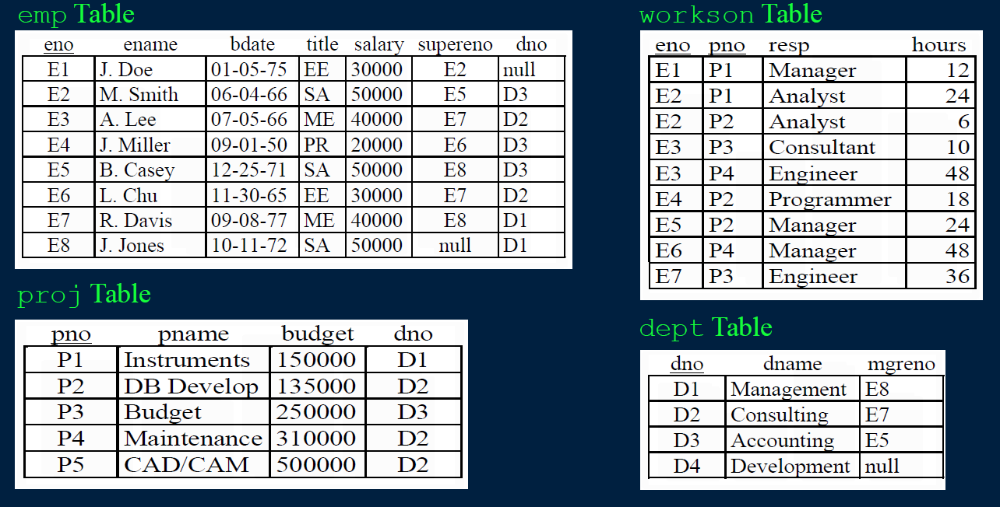

### SQL: Retrieving Only Some of the Columns
The **projection operation** creates a new table that has some of the columns of the input table. In SQL, provide the table in the `FROM` clause and the fields in the output in the `SELECT`.

Example: Return only the `eno` field from the `Emp` table:

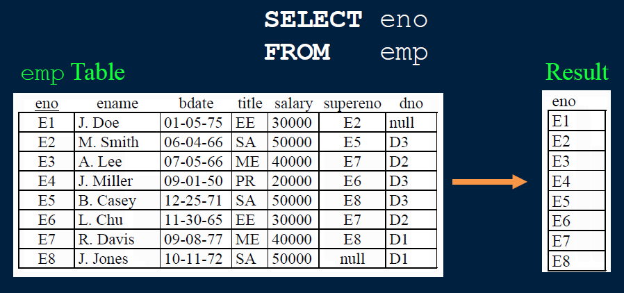

### SQL Projection Examples

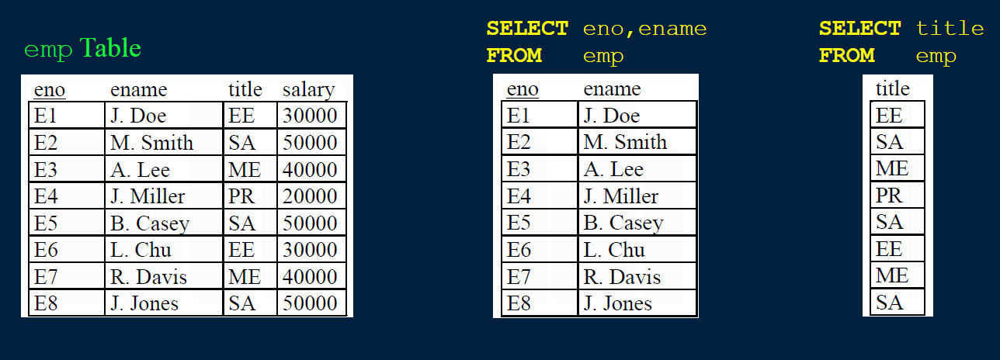

Notes:  
1) Duplicates are not removed during SQL projection.
2) `SELECT` *will return all columns.

### Projection Question
**Question**: Given this table and the query:
```
SELECT eno, ename, salary
FROM emp
```
How many columns are returned?
A)0 B)1 C)2 D)3 E)4

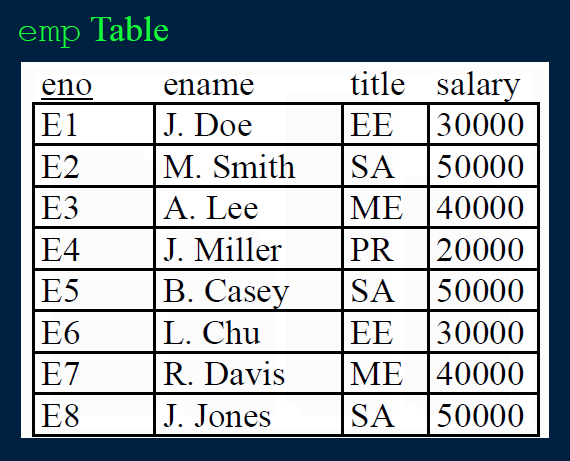

### Projection Question #2
**Question**: Given this table and the query:
```
SELECTsalary
FROMemp
```
How many rows are returned?  
A) 0  
B) 2  
C) 4  
D) 8  


### Duplicates in SQL
One major difference between SQL and relational algebra is that relations in SQL are **bags** instead of sets.
- It is possible to have two or more identical rows in a relation.
Consider the query: Return all titles of employees.
```
SELECT title
FROM emp
```


### Duplicates in SQL -DISTINCTclause
To remove duplicates, use `DISTINCT` clause in the SQL statement:
```
SELECT DISTINCTtitle
FROMemp
```


### DISTINCTQuestion
**Question**: Given this table and the query:
```
SELECTDISTINCT a, b
FROM R
```
How many rows are returned?  
A)1 B)3 C)4 D)6  

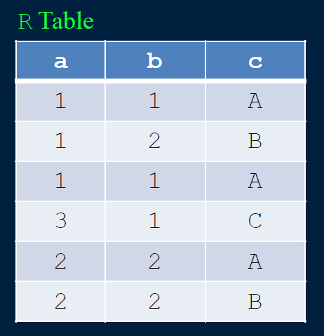


### Try it: SQL SELECTand Projection
**Question**: Using the `proj` table, write these three queries:  
**1) Show all rows and all columns.**  
**2) Show all rows but only the `pno` column.**  
**3) Show all rows but only the `pno` and budget columns.**  
**4) Show unique `budget` values.**  

### Retrieving Only Some of the Rows
The **selection operation** creates a new table with some of the rows of the input table. A condition specifies which rows are in the new table. The condition is similar to an ifstatement.

Example: Return the projects in department 'D2':
```
SELECT pno, pname, budget, dno
FROM proj
WHERE dno = 'D2'
```

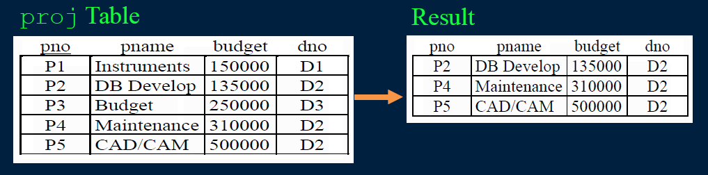

Algorithm: Scan each tuple and check if matches condition in `WHERE` clause.

### Selection Conditions
The condition in a selection statement specifies which rows are included. It has the general form of an if statement.

The condition may consist of attributes, constants, comparison operators (<, >, =, !=, <=, >=), andlogical operators (AND, OR, NOT).


### SQL Selection Examples
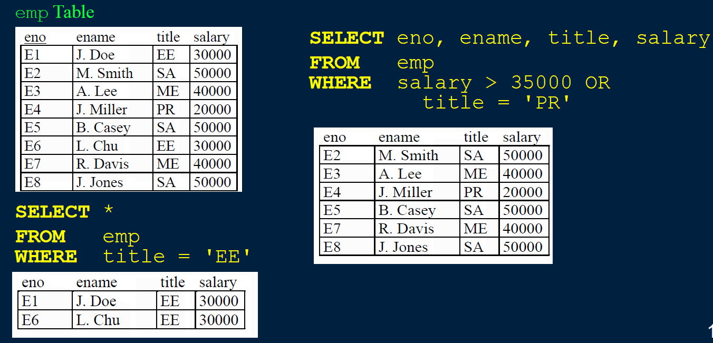

### Selection Question
**Question**: Given this table and the query:
```
SELECT*
FROMemp
WHEREtitle='SA'
```
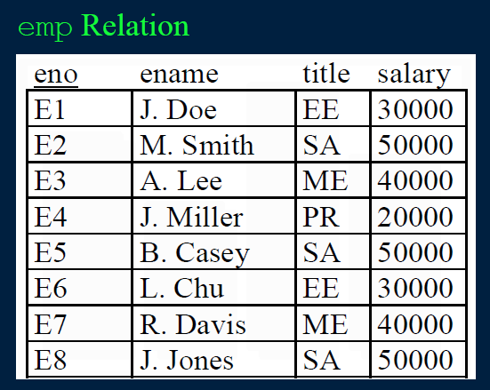
How many rows are returned?
A)0 B)1 C)2 D)3

### Selection Question #2
**Question**: Given this table and the query:
```
SELECT*
FROMemp
WHEREsalary > 50000 or title='PR'
```
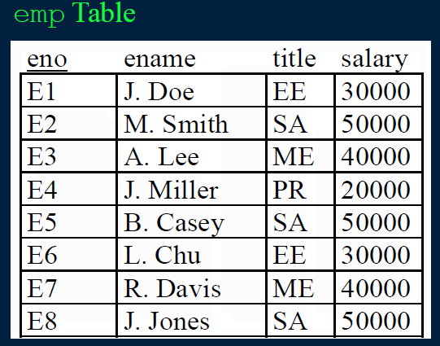
How many rows are returned?
A)0 B)1 C)2 D)3

### Try it: SQL SELECTand Filtering Rows
**Question**: Write these queries:
1) Return all projects with budget >$250000.
2) Show the pnoand pnamefor projects in dno = 'D1'.
3) Show pnoand dnofor projects in dno='D1'or dno='D2'.
4) Return the employee numbers who make less than $30000.
5) Return list of worksonresponsibilities (resp) with no duplicates.
6) Return the employee (names) born after July 1, 1970 that have a salary > 35000 and have a title of 'SA'or 'PR'.

### Joins for Combining Tables
A join combines two tables by matching columns in each table.


### Join Details and Examples
Listing multiple tables in the `FROM` clauseseparated by commas creates a cross product of tables. Must specify JOINand ONor provide join condition in WHEREclause.

**Goal**: For each employee, return their name and department name.
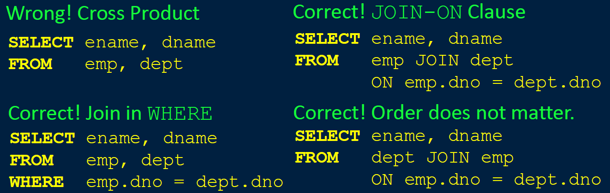

### Join Query with Selection Example
You can use join, selection, and projection in the same query.
- Recall: Projection returns columns listed in `SELECT`, selection filters out rows using condition in `WHERE`, and join combines tables in `FROM` using a condition.
Example: Return the employee names who are assigned to the 'Management' department.


### Three Table Join Query Example
Return all projects who have an employee working on them whose title is 'EE':
```
SELECT pname
FROM emp JOIN workson ON emp.eno = workson.eno
JOIN proj ON workson.pno = proj.pno
WHEREemp.title = 'EE'
```
Or:
```
SELECT pname
FROM emp, proj, workson
WHEREemp.title = 'EE' and workson.eno= emp.eno
and workson.pno = proj.pno
```
Note: Parentheses ()can be used to specify order of joins when using `JOIN-ON`.

### SQL Query Question
**Question**: What query would return the name and salary of employees working on project 'P3':
A) 
```
SELECT ename, salary
FROM emp, workson
WHERE emp.eno = workson.eno and pno = 'P3'
```
B)
```
SELECT ename, salary
FROM emp, workson, proj
WHERE emp.eno = workson.eno and pno = "P3"
```


### Ordering Result Data
The query result returned is not ordered on any column by default. We can order the data using the `ORDER BY` clause:
```
SELECTename, salary, bdate
FROMemp
WHEREsalary > 30000
ORDER BYsalary DESC, ename ASC;
```
- **'ASC' sorts the data in ascending order, and 'DESC' sorts it in descending order. The default is 'ASC'.**
- **The order of sorted attributes is significant. The first column specified is sorted on first, then the second column is used to break any ties, etc.**

### LIMIT and OFFSET
If you only want the first N rows, use a `LIMIT` clause:
```
SELECT ename, salary FROM emp
ORDER BYsalary DESC LIMIT 5
```
To start from a row besides the first, use `OFFSET`:
```
SELECT eno, salary FROM emp
ORDER BY eno DESC
LIMIT 3 OFFSET 2
```
- `LIMIT` improves performance by reducing amount of data processed and sent by the database system.
- `OFFSET`0 is first row, so `OFFSET`2 would return the 3rd row.
- `LIMIT`/`OFFSET` syntax supported differently by systems.
- Syntax for supporting `LIMIT` differs between databases.

### Try it: SQL SELECT with Joins and Ordering
**Question**: Write these queries:
1) Return all projects with budget <$500000sorted by budgetdescending.
2) List only the top 5 employees by salarydescending. Show only their nameand salary.
3) List each project pno, dno, pname, and dnameordered by dnoascending then pnoascending. Only show projects if department name > 'D'. Note: This query will require a join.
4) Return the list of project names for the department with name 'Consulting'.
5) Return worksonrecords (eno, pno, resp, hours) where project budgetis > $50000 and hours worked is < 20.
6) Challenge:Return a list of all department names, the names of the projects of that department, and the name of the manager of each department.


### Calculated Fields
Expressions are allowed in SELECTclause to perform calculations.
- When an expression is used to define an attribute, the DBMS gives the attribute a unique name such as col1, col2, etc.  

Example: Return how much employee 'A. Lee' will get paid for his work on each project.
```
SELECT ename, pname, salary/52/5/8*hours
FROM emp JOIN workson ON emp.eno=workson.eno
JOIN proj ON workson.pno=proj.pno
WHERE ename='A. Lee'
```
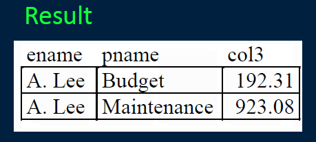

### Renaming and Aliasing
Often it is useful to be able to rename an attribute in the final result (especially when using calculated fields). Renaming is accomplished using the keyword **AS**:
```
FROM emp JOINworkson ON emp.eno = workson.eno
JOIN proj ON proj.pno = workson.pno
WHERE ename = 'A. Lee'
```


Note: AS keyword is optional.

### Renaming and Aliasing Tables
Renaming is also used when two or more copies of the same table are in a query. Using aliasesallows you to uniquely identify what table you are talking about.

Example: Return the employees and their managers where the managers make less than the employee.

```
SELECT E.ename, M.ename
FROM emp as EJOINemp as M ONE.supereno = M.eno
WHERE E.salary > M.salary
```


### Advanced Conditions -BETWEEN
Sometimes the condition in the `WHERE` clause will request tuples where one attribute value must be in a rangeof values.

Example: Return the employees who make at least $20,000 and less than or equal to $45,000.
```
SELECT ename
FROM emp
WHERE salary >= 20000 and salary <= 45000
```
We can use the keyword **BETWEEN** instead:
```
SELECT ename
FROM emp
WHERE salary BETWEEN 20000 and 45000
```

### Advanced Conditions -LIKE
For strings, the `LIKE` operator is used to search for partial matches.
- Partial string matches are specified by using either "%" that replaces zero or more characters or underscore "_" that replaces a single character.

Example: Return all employee names that start with 'A'.
```
SELECT ename
FROM emp
WHERE ename LIKE'A%'
```

Example: Return all employee names who have a first name that starts with 'J' and whose last name is 3 characters long.
```
SELECT ename
FROM emp
WHERE ename LIKE'J. _ _ _'
```

### Performance Concerns of LIKE
**Warning**: Do not use the `LIKE` operator if you do not have to.  

It is often an inefficient operation as the DBMS may not be able to optimize lookup using `LIKE` as it can for equal (=) comparisons. The result is the DBMS often has to examine ALL TUPLES in the relation.

In almost all cases, adding indexes will *not* increase the performance of LIKEqueries because the indexes cannot be used.
- **Most indexes are implemented using B-trees that allow for fast equality searching and efficient range searches.**

### Advanced Conditions -IN
To specify that an attribute value should be in a given set of values, the `IN` keyword is used.
- Example: Return employees who are in one of the departments {'D1', 'D2', 'D3'}.
```
SELECT ename
FROM emp
WHERE dno IN ('D1','D2','D3')
```

Note that this is equivalent to using OR:
```
SELECT ename
FROM emp
WHERE dno = 'D1' OR dno = 'D2' OR dno = 'D3'
```
We will see more uses of `IN` and `NOT IN` with nested subqueries.

### Advanced Conditions - NULL
Remember `NULL` indicates that an attribute does not have a value. To determine if an attribute is `NULL`, we use the clause **IS NULL**.
- Note that you cannot test NULLvalues using = and <>.

Example: Return all employees who are not in a department.
```
SELECT ename
FROM emp
WHERE dno IS NULL
```
Example: Return all departments that have a manager.
```
SELECT dname
FROMd ept
WHERE mgreno IS NOT NULL
```

### Set Operations
Union, intersection, and difference combine results of two queries.
- `UNION`, `INTERSECT`, `EXCEPT`, `UNION ALL`(returns all rows)
- **Union-compatible**: same # of attributes and compatible data types. Do not need to have the same name.

Example: Return the employees who are either directly supervised by 'R. Davis' or directly supervised by 'M. Smith'.
```
(SELECT E.ename
FROM emp as E JOIN emp as M ON E.supereno = M.eno
WHERE M.ename='R. Davis')
UNION
(SELECTE.ename
FROM emp as E JOIN emp as M ON E.supereno = M.eno
WHERE M.ename='M. Smith')
```

### Set Operations Examples
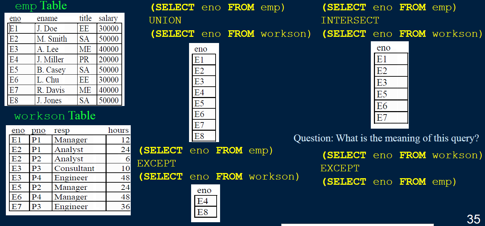

### Set Operations Union-compatible Question
**Question**:
Two tables have the same number of fields in the same order with the same types, but the names of some fields are different.   
**True or false**: The two tables are union-compatible.
A) true  
B) false  


### SELECT INTO
The result of a select statement can be stored in a temporary table using the **INTO** keyword.
```
SELECT E.ename
INTO davisMgr
FROM emp as E JOIN emp as M ON E.supereno = M.eno
WHERE M.ename = 'R. Davis'
```

### SQL Querying with NULLand LIKE
**Question**: What query would return the department names that do not have a manager or contain 'ent'.
A) 
```
SELECT dname
FROM dept
WHERE mgreno = NULL OR dname LIKE '_ent'
```
B)
```
SELECT dname
FROM dept
WHERE
mgreno IS NULL OR dname LIKE '%ent%'
```

### Try it: SQL SELECT Expressions, LIKE, IS NULL
**Question**:
Write these queries:  
1) Calculate the monthly salary for each employee.
2) List all employee names who do not have a supervisor.
3) List all employee names where the employee's name contains an 'S'and workson responsibility that ends in 'ER'.
4) Return the list of employees (names) who make less than their managers and how much less they make.
5) Return only the top 3 project budgets in descending order.

### Try it: SQL SELECTSet Operations, ORDER BY
**Question**: Write these queries:
1) Return the list of employees sorted by salary (desc) and then title (asc).
2) Return the employees (names) who either manage a department or manage another employee.
3) Return the employees (names) who manage an employee but do not manage a department.
4) Give a list of all employees who work on a project for the 'Management' department ordered by project number (asc).
5) **Challenge**: Return the projects (names) that have their department manager working on them.

### Conclusion
The **SELECT** statement is used to query data and combines the operations of selection, projection, and join.  
**SELECT** features covered:
- **SELECT** clause to provide column list and calculate expressions
- **DISTINCT** clause to eliminate duplicates
- **FROM** clause to list tables
- **JOIN ON** syntax to join tables on a join condition
- **UNION**, **EXCEPT**, **INTERSECT** set operations
- **IS NULL** for checking if column value is null
- **ORDER BY** clause for sorting output
- **LIMIT/OFFSET** for only reducing a part of the result set

### Objectives
Translate English questions into SQL queries that may require:
- `SELECT-FROM-WHERE` syntax for selection, projection, and join
- renaming and aliasing including queries with multiple copies of the same relation
- `ORDER BY`
- `LIMIT`/`OFFSET`
- `DISTINCT` to eliminate duplicates
- `UNION`, `EXCEPT`, `INTERSECT` set operations
- `IS NULL` or `IS NOT NULL`
- `LIKE` string pattern matching
Read SQL queries to determine their output and English meaning


