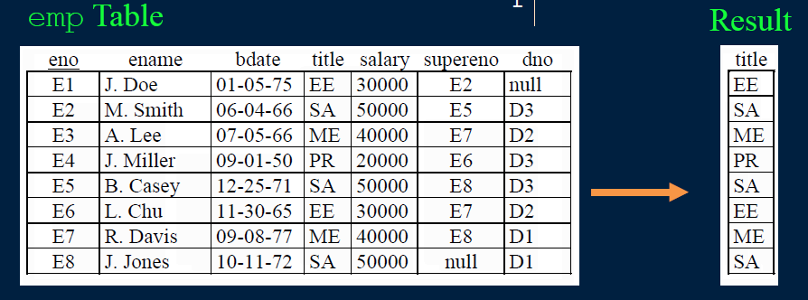

# lecture 3

## SQL: SELECT Statement select-project-join-order by

<STAR SLIDE STARTS>

### SQL Queries using SELECT
A query in SQL has the form:
```
SELECT (list of columns or expressions)  
FROM (list of tables)  
WHERE (filter conditions)  
GROUP BY (columns)  
ORDER BY (columns)  
```

Notes:  
1) Separate the list of columns/expressions and list of tables by **commas**.
2) The "*" is used to select all columns.
3) Only `SELECT` required. `FROM`, `WHERE`, `GROUP BY`, `ORDER BY` are optional.

<STAR SLIDE ENDS>

### Example Database - WorksOn


### SQL: Retrieving Only Some of the Columns
The **projection operation** creates a new table that has some of the columns of the input table. In SQL, provide the table in the `FROM` clause and the fields in the output in the `SELECT`.

Example: Return only the `eno` field from the `Emp` table:


### SQL Projection Examples


Notes:  
1) Duplicates are not removed during SQL projection.
2) `SELECT` *will return all columns.

### Projection Question
**Question**: Given this table and the query:
```
SELECT eno, ename, salary
FROM emp
```
How many columns are returned?
A)0 B)1 C)2 D)3 E)4


### Projection Question #2
**Question**: Given this table and the query:
```
SELECTsalary
FROMemp
```
How many rows are returned?  
A) 0  
B) 2  
C) 4  
D) 8  


### Duplicates in SQL
One major difference between SQL and relational algebra is that relations in SQL are **bags** instead of sets.
- It is possible to have two or more identical rows in a relation.
Consider the query: Return all titles of employees.
```
SELECT title
FROM emp
```



### Duplicates in SQL -DISTINCTclause
To remove duplicates, use `DISTINCT` clause in the SQL statement:
```
SELECT DISTINCTtitle
FROMemp
```


### DISTINCTQuestion
**Question**: Given this table and the query:
```
SELECTDISTINCT a, b
FROM R
```
How many rows are returned?  
A)1 B)3 C)4 D)6  


### Try it: SQL SELECTand Projection
**Question**: Using the `proj` table, write these three queries:  
**1) Show all rows and all columns.**  
**2) Show all rows but only the `pno` column.**  
**3) Show all rows but only the `pno` and budget columns.**  
**4) Show unique `budget` values.**  

### Retrieving Only Some of the Rows
The **selection operation** creates a new table with some of the rows of the input table. A condition specifies which rows are in the new table. The condition is similar to an ifstatement.

Example: Return the projects in department 'D2':
```
SELECT pno, pname, budget, dno
FROM proj
WHERE dno = 'D2'
```


Algorithm: Scan each tuple and check if matches condition in `WHERE` clause.

YOU ARE AT PAGE 12 CLAIRE!

