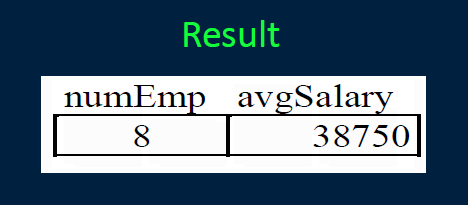

# Lecture 4

## SQL: GROUP BY, Aggregation, Subqueries, Outer Joins

### Aggregate Queries and Functions
Several queries cannot be answered using the simple form of the `SELECT` statement. These queries require a summary calculation to be performed. 

Examples:
- **What is the maximum employee salary?**
- **What is the total number of hours worked on a project?**
- **How many employees are there in department 'D1'?**
To answer these queries requires the use of aggregate functions.  
These functions operate on a single column of a table and return a single value.


### Aggregate Functions
Five common aggregate functions are:
- COUNT-returns the # of values in a column
- SUM-returns the sum of the values in a column
- AVG-returns the average of the values in a column
- MIN-returns the smallest value in a column
- MAX-returns the largest value in a column

Notes:
1) `COUNT`, `MAX`, and `MIN` apply to all types of fields, whereas SUMand AVGapply to only numeric fields.
2) Except for `COUNT(*)` all functions ignore nulls. `COUNT(*) returns the number of rows in the table.
3) Use `DISTINCT` to eliminate duplicates.

### Aggregate Function Example
Return the number of employees and their average salary.
```
SELECTCOUNT(eno) AS numEmp, AVG(salary) AS avgSalary
FROM emp
```


### GROUP BY Clause
Aggregate functions are most useful when combined with the **GROUP BY** clause. The GROUP BYclause groups the tuples based on the values of the attributes specified.

When used in combination with aggregate functions, the result is a table where each tuple consists of unique values for the group by attributes and the result of the aggregate functions applied to the tuples of that group.

### GROUP BY Example
For each employee title, return the number of employees with that title, and the minimum, maximum, and average salary.
```
SELECT title, COUNT(eno) AS numEmp,
MIN(salary) as minSal,
MAX(salary) as maxSal, AVG(salary) AS avgSal
FROM emp
GROUP BY title
```


### GROUP BYClause Rules
There are a few rules for using the `GROUP BY` clause:
1) A column name cannot appear in the `SELECT` part of the query unless it is part of an aggregate function or in the list of group by attributes.
  - Note that the reverse is allowed: a column can be in the `GROUP BY` without being in the `SELECT` part.
2) Any `WHERE` conditions are applied before the `GROUP BY` and aggregate functions are calculated.
3) You can group by multiple attributes. To be in the same group, all attribute values must be the same.


### GROUP BY Question
**Question**: Given this table and the query:
```
SELECT title, SUM(salary)
FROM emp
GROUP BY title
```

How many rows are returned?
A)1 B)2 C)4 D)8

### GROUP BY Question #2
**Question**: Given this table and the query:
```
SELECT resp, pno, SUM(hours)
FROM workson
WHERE hours > 10
GROUP BY resp, pno
```

How many rows are returned?
A)9 B)7 C)5 D)1 E)0


### HAVING Clause
The **HAVING** clause is applied *AFTER* the `GROUP BY` clause and aggregate functions are calculated.

It is used to filter out entire groupsthat do not match certain criteria.

The **HAVING** clause can contain any condition that references aggregate functions and the group by attributes themselves.
- **However, any conditions on the `GROUP BY` attributes should be specified in the `WHERE` clause if possible due to performance reasons.**

### HAVING Example
Return the title and number of employees of that title where the number of employees of the title is at least 2.
```
SELECT title, COUNT(eno) AS numEmp
FROM emp
GROUP BY title
HAVING COUNT(eno) >= 2
```


### GROUP BY/HAVING Example
For employees born after December 1, 1965, return the average salary by department where the average is > 40,000.
```
SELECTd name, AVG(salary) AS avgSal
FROM emp JOIN dept ON emp.dno = dept.dno
WHERE emp.bdate > DATE '1965-12-01'
GROUP BY dname
HAVING AVG(salary) > 40000
```
Step #1: Perform `Join` and Filter in `WHERE` clause


Step #2: `GROUP BY` on dname


                                                              
Step #3: Calculate aggregate functions


Step #4: Filter groups using `HAVING` clause


### GROUP BY Examples

Return the average budget per project:
```
SELECT AVG(budget) FROM proj
```
Return the average # of hours worked on each project:
```
SELECT pno, AVG(hours) FROM workson GROUP BY pno
```
Return the departments that have projects with at least 2 'EE's working on them:
```
SELECT DISTINCT proj.dno
FROM proj JOIN workson ON workson.pno = proj.pno
JOIN emp ON workson.eno=emp.eno
WHERE emp.title = 'EE' GROUP BY proj.dno, proj.pno
HAVING COUNT(*) >=2
```

### GROUP BY/HAVING Multi-Attribute Example
Return the employee number, department number and hours the employee worked per department where the hours is >= 10.
```
SELECT W.eno, D.dno, SUM(hours)
FROM workson AS W JOIN proj AS P ON W.pno = P.pno JOIN dept AS D ON P.dno = D.dno
GROUP BY W.eno, D.dno
HAVING SUM (hours) >= 10
```
Question:
1) How would you only return records for departments D2 and D3?


### SQL Querying with GROUP BY

**Question**: Of the following queries, select one which is **invalid**.
A)
```
SELECT dname
FROM dept
GROUP BY dno
```
B)
```
SELECT COUNT(*)
FROM dept
```
C)
```
SELECT dno, COUNT(*)
FROM dept
```
D)
```
SELECT dno, COUNT(*)
FROM dept WHERE mgreno > 'A'
GROUP BY dno, dname
```

### Try it: SQL GROUP BY Practice Questions
**Question**: Write these queries:

1) Return the highest salary of any employee.
2) Return the smallest project budget.
3) Return the department number and average budget for its projects.
4) For each project, return its name and the total number of hours employees have worked on it.
5) For each employee, return the total number of hours they have worked. Only show employees with more than 30 hours.

### Subqueries
SQL allows a single query to have multiple subqueries nested inside of it. This allows for more complex queries to be written.

When queries are nested, the outer statement determines the contents of the final result, while the inner `SELECT` statements are used by the outer statement (often to lookup values for `WHERE` clauses).

```
SELECT ename, salary, bdate
FROM emp
WHERE salary > (SELECT AVG(salary) FROM emp)
```
A subquery can be in the `SELECT`, `FROM`, `WHERE` or `HAVING` clause.

### Types of Subqueries
There are three types of subqueries:
1) **scalar subqueries** - return a single value. Often value is then used in a comparison.
  - If query is written so that it expects a subquery to return a single value, and if it returns multiple values or no values, a run-time error occurs.
2) **row subquery** - returns a single row which may have multiple columns.
3) **table subquery** - returns one or more columns and multiple rows.

### Scalar Subquery Examples
Return the employees that are in the 'Accounting' department:
```
SELECT ename
FROM emp
WHERE dno = (SELECTdno FROMdept
WHERE dname = 'Accounting')
```
Return all employees who work more hours than average on a single project:
```
SELECT ename
FROM emp JOIN workson ON workson.eno = emp.eno
WHERE workson.hours > (SELECT AVG(hours) FROM workson)
```

### Table Subqueries
A table subquery returns a relation. There are several operators that can be used:
- **EXISTS R - true if R is not empty**
- **s IN R - true if s is equal to one of the values of R**
- **s > ALL R - true if s is greater than *every* value in R**
- **s > ANY R - true if s is greater than *any* value in R**

Notes:  
1) **Any of the comparison operators (<, <=, =, etc.) can be used.**
2) **The keyword NOT can proceed any of the operators.**
- *Example: s NOT IN R*

### Table Subquery Examples
Return all departments who have a project with a budget greater than $300,000:
```
SELECTdname FROMdept WHERE dno IN
(SELECTdno FROMproj WHEREbudget > 300000)
```
Return all projects that 'J. Doe' works on:
```
SELECTpname FROMproj WHERE pno IN
(SELECTpno FROMworkson WHEREeno =
(SELECTeno FROMemp WHEREename = 'J. Doe'))
```

### EXISTS Example
The `EXISTS` function is used to check whether the result of a nested query is empty or not.
- **`EXISTS` returns true if the nested query has 1 or more tuples.**

Example: Return all employees who have the same name as someone else in the company.
```
SELECT ename
FROM emp as E
WHERE EXISTS(SELECT* FROM emp as E2
              WHERE E.ename = E2.ename AND
              E.eno <> E2.eno)
```

### ANY and ALL Example
`ANY` means that any value returned by the subquery can satisfy the condition.
`ALL` means that all values returned by the subquery must satisfy the condition.

Example: Return the employees who make more than all the employees with title 'ME' make.
```
SELECT ename
FROM emp as E
WHERE salary > ALL(SELECT salary FROM emp
                  WHERE title = 'ME')
```


### Subquery Syntax Rules
1) The `ORDER BY` clause may not be used in a subquery.
2) The number of attributes in the `SELECT` clause in the subquery must match the number of attributes compared to with the comparison operator.
3) Column names in a subquery refer to the table name in the `FROM` clause of the subquery by default. You must use aliasing if you want to access a table that is present in both the inner and outer queries.

### Correlated Subqueries
Most queries involving subqueries can be rewritten so that a subquery is not needed.
- **This is normally beneficial because query optimizers may not do a good job at optimizing queries containing subqueries.**

A nested query is *correlated* with the outside query if it must be re-computed for every tuple produced by the outside query. Otherwise, it is *uncorrelated*, and the nested query can be converted to a non-nested query using joins.

A nested query is correlated with the outer query if it contains a reference to an attribute in the outer query.


### Correlated Subquery Example
Return all employees who have the same name as another employee:
```
SELECT ename
FROM emp as E
WHERE EXISTS(SELECT eno FROM emp as E2
            WHERE E.ename = E2.ename AND
            E.eno <> E2.eno)
```
A more efficient solution with joins:
```
SELECT E.ename
FROM emp as E JOIN emp as E2 ON
E.ename = E2.ename AND E.eno <> E2.eno
```

### Types of Joins
A **equijoin** only contains the equality operator (=).
- e.g. workson JOIN Proj ON workson.pno=proj.pno

A **natural join** is equijoin of two tables with commonly named fields.
- Removes the “extra copies” of the join attributes.
- The attributes must have the same name in both relations.
- e.g. workson NATURAL JOIN Proj

**Left outer join** – contains all tuples of first table even if no match  
**Right outer join** – contains all tuples of second table even if no match  
**Full outer join** – contains all tuples of either table even if no match. For a tuple that does not have a match, missing fields are NULL.  


### Specifying Outer Joins in SQL
Types: NATURAL JOIN, FULL OUTER JOIN, LEFT OUTERJOIN, RIGHT OUTER JOIN, INNER JOIN, JOIN
- The keyword "outer" can be omitted for outer joins. Same with "inner".

Example: Return all departments (even those without projects) and their projects.
```
SELECT dname, pname
FROM dept LEFT OUTER JOIN proj ON dept.dno = proj.dno
SELECT dname, pname
FROM dept LEFT OUTER JOIN proj USING (dno)
SELECT dname, pname
FROM dept NATURAL LEFT JOIN proj
```

### Equijoin Example


### Natural Join Example

                                                                 
### Right Outer Join Example


### Outer Join Question
**Question**: Given this table and the query:

```
SELECT*
FROM workson LEFT OUTER JOIN proj P
ON workson.pno = proj.pno
```                                                                
How many rows are returned?
A)10  
B) 9  
C) 8  
D) 7   
                                                                
### Subqueries in FROMClause
Subqueries are used in the `FROM` clause to produce temporary table results for use in the current query.

Example: Return the departments that have an employee that makes more than $40,000.                                                                
```
SELECT dname
FROMD ept D, (SELECT ename, dno FROM Emp
WHERE salary > 40000) E
WHERE D.dno = E.dno
```
- Note: The alias for the derived table is required.


### SQL Querying with Subqueries

**Question**: What query below is equivalent to:
```
SELECT ename
FROM emp as E
WHERE salary > ALL(SELECT salary
                  FROM empWHERE title = 'EE')
```
A)
```
SELECT ename
FROM emp as E
WHERE salary > (SELECT MAX(salary) FROM emp
WHERE title = 'EE')
```
B)
```
SELECT ename
FROM emp as E
WHERE salary > (SELECT SUM(salary) FROM emp
WHERE title = 'EE')
```


### SQL Functions
Databases have many built-in functions that can be used when writing queries. Syntax and support varies between systems.
- Date: DATEDIFF, YEAR, GETDATE
- String: CONCAT, UPPER, LEFT, SUBSTRING
- Logical: CASE, IIF, ISNULL
- Aggregate: SUM, COUNT, AVG
- Note: Case-insensitive function names.

Example:
```
SELECT eno, UPPER(ename),
CASE title WHEN 'EE' THEN'Engineer'
WHEN'SA' THEN'Admin' ELSE'Other' END as role,
year(bdate) as birth Year
FROM emp
WHERE salary * 2 > 60000
```

### Try-it: Subquery Practice Questions
**Question**: Write these queries:
1) List all departments that have at least one project.
2) List the employees who are not working on any project.
3) List the employees with title 'EE’ that make more than all employees with title 'PR'.
4) Find all employees who work on some project that 'J. Doe' works on.


<STAR SLIDE STARTS>
  
### SQL Queries using SELECT
A query in SQL has the form:
**SELECT** (list of columns or expressions)
**FROM** (list of tables)
**WHERE** (filter conditions)
**GROUP BY** (columns)
**HAVING** (group filter conditions)
**ORDER BY** (columns)
**LIMIT** (count) **OFFSET** (start)

<STAR SLIDE ENDS>
  
  

### Conclusion
**SQL** is the standard language for querying relational databases.  
The **SELECT** statement is used to query data and combines the relational algebra operations of selection, projection, and join into one statement
- **There are often many ways to specify the same query.**
Queries may involve aggregate functions, outer joins, and subqueries.

### Objectives
- Write SQL queries containing aggregate functions and calculated fields.
- Write SQL queries requiringnested subqueries and the use of the appropriate operatorssuch as comparison operators for single value subqueries, `IN`, `NOT IN`, `ANY`, `ALL` for table result subqueries, and `EXISTS` and `NOT EXISTS` for multiple result subqueries which may or may not contain results.
- Lookup documentation on SQL functions supported by a particular database and use them as required in queries.
- Explain the purpose of OUTERand NATURALjoins and use them for queries.

